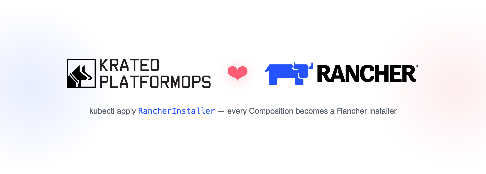

# Krateo Blueprint — Rancher

<p align="center">
  <picture>
    <source media="(prefers-color-scheme: dark)" srcset="docs/hero-dark.png">
    
  </picture>
</p>

A [Krateo](https://krateo.io) blueprint that installs [Rancher](https://www.rancher.com/)
on a Kubernetes cluster. It is a **fork of the upstream Rancher Helm chart** (`2.14.2`),
renamed `rancher-installer`, wrapped in a `CompositionDefinition`. Once that
`CompositionDefinition` is applied, **every `RancherInstaller` Composition you create
becomes a Rancher installer**.

## What is this

The repo carries one Helm chart (`chart/`, name `rancher-installer`) and the sibling
`compositiondefinition.yaml` that registers it with Krateo's `core-provider`. The fork
exists for two reasons ([docs/overview.md](docs/overview.md)):

- `core-provider` builds the Composition CRD from the chart's `values.schema.json` **only**
  — and upstream Rancher ships only a *partial* schema (6 fields, `if/then` + type-unions
  crdgen cannot express), so essential fields like `hostname` could not be set on a
  Composition. This fork replaces it with a complete, crdgen-suitable schema.
- `templates/service.yaml` is patched so a Composition can **force the NodePort number**
  (`service.httpNodePort` / `service.httpsNodePort`).

The chart name is `rancher-installer` (not `rancher`) so the generated Kind is
`RancherInstaller`, and to avoid colliding with `chart-inspector`'s release-named
scaffolding RBAC and Rancher's own release-named cluster-admin `ClusterRoleBinding`.

## Install

Prerequisites: Krateo `core-provider` (tested `1.0.0`) and **cert-manager — REQUIRED,
installed separately, _before_ this composition** (Rancher's `Issuer` CRD must exist at
render time; the only exception is `ingress.tls.source: secret`).

```sh
# core-provider + cert-manager (see docs/usage.md for the full commands)
helm upgrade --install core-provider krateo/core-provider --version 1.0.0 -n krateo-system --create-namespace
helm upgrade --install cert-manager jetstack/cert-manager --version v1.20.2 -n cert-manager --create-namespace --set crds.enabled=true

# register the blueprint
kubectl create namespace cattle-system
kubectl apply -f compositiondefinition.yaml
```

This publishes the `RancherInstaller` Composition type (`composition.krateo.io/v0-1-0`,
plural `rancherinstallers`), pulling the chart from
`oci://ghcr.io/krateo-blueprints/charts/rancher-installer`. Full walkthrough:
[docs/usage.md](docs/usage.md).

## Configure

A `RancherInstaller` `spec` is the chart's values, **top-level**. `hostname` is the only
required field. Highlights (full surface: [docs/configuration.md](docs/configuration.md),
generated CRD: [docs/api.md](docs/api.md)):

| Value | Default | Description |
|---|---|---|
| `hostname` | `rancher.example.com` | DNS name to reach Rancher. **Required.** |
| `bootstrapPassword` | _(random)_ | Initial password for the local `admin` user. |
| `replicas` | `3` | Replica count; use `1` for single-node clusters. |
| `ingress.tls.source` | `rancher` | `rancher` / `letsEncrypt` / `secret`. |
| `service.type` | `ClusterIP` | `ClusterIP` / `NodePort` / `LoadBalancer`. |
| `service.httpsNodePort` | _(auto)_ | Force the https node port (e.g. for kind). |

```yaml
apiVersion: composition.krateo.io/v0-1-0
kind: RancherInstaller
metadata:
  name: rancher
  namespace: cattle-system
spec:
  hostname: rancher.my.org
  replicas: 1
  ingress:
    tls:
      source: rancher
  service:
    type: NodePort
    httpsNodePort: 30443
```

Or drive it from the Krateo Composable Portal: `kubectl apply -f customform.yaml`.

## Examples

- [examples/kind-nodeport](examples/kind-nodeport/README.md) — end-to-end on a kind
  cluster: register the `CompositionDefinition`, create a single-replica `RancherInstaller`
  with a NodePort forced to `30443`, and open the Rancher UI at `https://localhost:30443`
  with no port-forwarder. The same scenario is walked through in
  [`quickstart.md`](quickstart.md).

## Docs

The full documentation bundle lives under [`docs/`](docs/):

- [docs/index.md](docs/index.md) — the map of the bundle.
- [docs/overview.md](docs/overview.md) — architecture: fork-not-wrapper, the
  chart→CRD→Composition flow, cert-manager as a prerequisite.
- [docs/usage.md](docs/usage.md) — install, register, create a Composition, reach the UI.
- [docs/configuration.md](docs/configuration.md) — the whole Composition surface.
- [docs/api.md](docs/api.md) — the generated `RancherInstaller` CRD and the
  `CompositionDefinition`.
- [docs/examples.md](docs/examples.md) — the runnable examples index.
- [docs/release.md](docs/release.md) — how a tag ships the chart, and the re-fork runbook.
- [docs/log.md](docs/log.md) — curated history.
- [docs/llms.txt](docs/llms.txt) — the file-by-file index.

## Develop & release

The chart is a self-contained fork (no dependencies). One plain-semver tag (`X.Y.Z`, no
`v` prefix) releases it:

```sh
git tag 0.1.0 && git push origin 0.1.0
# → .github/workflows/release-tag.yaml packages chart/ and pushes
#   oci://ghcr.io/krateo-blueprints/charts/rancher-installer:0.1.0
```

`.github/workflows/lint.yaml` runs `helm lint` + `helm template` and the shared
`lint-docs` check on every PR. **Updating Rancher = re-fork** (replace `templates/`,
`scripts/`, `values.yaml` from the new upstream version, re-apply the `service.yaml`
NodePort patch, reconcile `values.schema.json`) — the runbook is in
[docs/release.md](docs/release.md).
